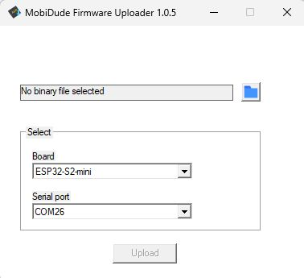

# Mobiflight-TFT-Instruments

## Set up platformIO
To use all Flash and PSRAM from the ESP32-S3-devkitc-1 with 16MB flash and 8MB PSRAM, the required defines are part of `Instruments_platformio.ini` (see `board_build.xyz` and `board_upload.xyz`). So no need anymore to copy `boad.json` files as mentioned before.

## additional branches
Two branches are included:
* support for Raspberry Pico 2: most instruments are not running due to less memory. Use instead a board with PSRAM, but this has to be tested in future
* rework of the StandbyAttitudeModule: for Airspeed and Altitude no additional sprites are used anymore. Check how it looks on the display! Some improvements could be also done for the AttitudeIndicator...

## Flashing the ESP32
Download [MobiDude release zip here](https://github.com/elral/MobiDude/releases/latest/) and extract the content to e.g. your Desktop.
Start `MobiDude.exe`, choose your your bin file, ESP32 as board, COM port, and press `Upload`

Caution! Your bin file must contain `merged`

## Backlight Pin
As at least one Pin must be defined for a device and the pin for the backlight is not required for the TFT lib, this pin is now required to be defined in the Mobiflight Modules device dialog.
Make sure this pin is properbly defined, it was Pin 13 for the ESP32 and Pin 0 for the Pico.

## Known Bugs
* When deleting a display in the connector and defining a new one, the ESP32 crashes. This will give an error uploading fails. It's due to the TFT library. I haven't found a way to de-initialize the lib (it's simple not supported).
* ...

## Speed comparison
| Instrument    | this FW    | original  |
| ------------- | ---------- | --------- | 
| Airspeed      | 20 fps     |  12.8 fps |
| Altimeter     | 7.5 fps    |  4.8 fps  |
| Attitude      | 6.3 fps    |  3.4 fps  |
| Turn Coord.   | 22.5 fps   |  15.9 fps |
| Vertical Ind. | 19.8 fps   |  16 fps   |
| Std.ByAtt.Mod.| 6.1 fps    |  7 fps    |
| Heading Ind.  |   tbd      |    tbd    |
